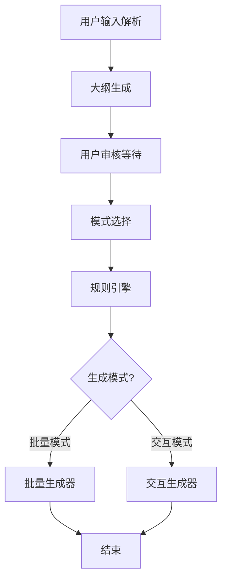

# Canvas Agent - 智能课件生成系统

基于 LangGraph 构建的智能、可控、支持多模式生成的自动化课件（Slide）生成 Agent。它将用户的自然语言需求转化为专业、结构化的 moffee Markdown 课件，极大提升内容创作效率。

## ✨ 核心特性

- 🤖 **智能大纲生成**: 基于AI自动生成结构化课件大纲
- 🎯 **用户交互审核**: 支持大纲编辑和审核确认
- 🔀 **双重生成模式**: 支持批量生成和交互式逐页生成
- 📝 **Moffee格式**: 输出专业的Moffee Markdown格式课件
- 🔧 **规则引擎**: 动态生成内容规则，确保输出质量
- 💻 **实时预览**: 交互模式下支持moffee实时预览

## 🏗️ 系统架构



## 📋 工作流程

1. **用户输入**: 提供课件需求描述和页数
2. **大纲生成**: AI自动生成结构化课件大纲
3. **用户审核**: 可以编辑大纲文件进行定制
4. **模式选择**: 选择批量生成或交互模式
5. **规则制定**: 根据需求动态生成内容规则
6. **内容生成**: 按选定模式生成课件内容
7. **预览输出**: 生成最终的moffee格式课件

## 🚀 快速开始

### 环境要求

- Python 3.8+
- conda环境: `s_agent`

### 安装依赖

```bash
# 激活conda环境
conda activate s_agent

# 安装依赖包
pip install langgraph langchain langchain-openai openai
```

### 运行方式

#### 1. 交互式模式（推荐）

```bash
python main.py
```

#### 2. 命令行模式

```bash
python main.py --query "Python入门教程" --pages 10
```

#### 3. 显示工作流结构

```bash
python main.py --show-workflow
```

### 使用示例

```bash
# 交互式生成Python教程
python main.py

# 快速生成机器学习课件
python main.py -q "机器学习基础知识" -p 15 -o ml_slides.md

# 查看帮助信息
python main.py --help
```

## 📁 项目结构

```
canvas_agent/
├── __init__.py              # 包初始化
├── main.py                  # 主程序入口
├── config.py                # 配置文件
├── workflow.py              # LangGraph工作流定义
├── nodes/                   # 工作流节点
│   ├── __init__.py
│   ├── user_input_parser.py # 用户输入解析
│   ├── outline_generator.py # 大纲生成
│   ├── user_approval.py     # 用户审核
│   ├── mode_selector.py     # 模式选择
│   ├── rule_engine.py       # 规则引擎
│   ├── batch_generator.py   # 批量生成
│   └── interactive_generator.py # 交互生成
└── utils/                   # 工具模块
    ├── __init__.py
    ├── state.py             # 状态定义
    └── helpers.py           # 辅助函数
```

## 🔧 配置说明

### AI模型配置

系统使用配置文件中的AI模型设置：

```python
OPENAI_BASE_URL = "http://35.220.164.252:3888/v1/"
OPENAI_API_KEY = "sk-CnqCf4NENTwZwLLQJwPuH4ZZ1uIGIRJSyTStRkSXNV1Hb2Kj"
OPENAI_MODEL = "moonshotai/kimi-k2"
```

### 环境变量支持

可以通过环境变量覆盖配置：

```bash
export CANVAS_OPENAI_BASE_URL="your_base_url"
export CANVAS_OPENAI_API_KEY="your_api_key"
export CANVAS_OPENAI_MODEL="your_model"
```

## 📝 生成模式

### 批量生成模式

- 一次性生成所有页面内容
- 速度快，适合对大纲有信心的场景
- 输出完整的课件文件

### 交互生成模式

- 逐页生成，每页都可修改
- 支持moffee实时预览
- 可以根据反馈调整每页内容
- 适合需要精细控制的场景

## 🎨 Moffee 语法支持

系统完全支持Moffee Markdown语法：

- 页面分隔: `---`
- 水平布局: `<->`
- 垂直布局: `===`
- 样式装饰: `@(layout=centered)`
- 主题配置: frontmatter
- 丰富的Markdown扩展语法

## 📖 使用技巧

1. **大纲编辑**: 生成大纲后，可以编辑`outline.json`文件进行定制
2. **交互模式**: 如需精确控制每页内容，建议使用交互模式
3. **预览功能**: 确保安装了moffee以使用实时预览功能
4. **内容调整**: 可以通过修改需求描述来影响生成风格

## 🛠️ 开发说明

### 扩展节点

要添加新的工作流节点：

1. 在`nodes/`目录下创建新文件
2. 实现节点函数，接受和返回`GraphState`
3. 在`workflow.py`中注册节点

### 自定义规则

可以在`rule_engine.py`中添加新的规则生成逻辑：

```python
def extract_dynamic_rules_from_query(query: str) -> str:
    # 添加自定义规则逻辑
    pass
```

## ⚠️ 注意事项

1. 确保在正确的conda环境下运行
2. 需要网络连接访问AI模型
3. moffee预览功能需要安装moffee包
4. 大文件生成可能需要较长时间

## 📄 许可证

MIT License

## 🤝 贡献

欢迎提交Issue和Pull Request来改进这个项目！