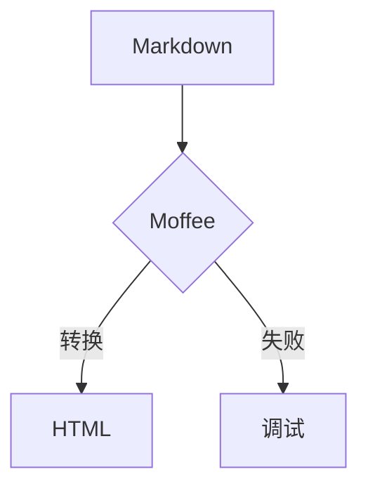

@(layout=centered)

# Moffee模板测试
## 打造零摩擦的幻灯片即代码体验

---

## 项目目标
验证 Moffee 模板能否在 **5 分钟内** 将 Markdown 源文件自动生成为可在浏览器直接打开的 HTML 演示文稿。

测试重点包括：
- 样式一致性
- 数学公式
- 代码高亮
- 图表渲染
- 脚注及交互链接

---

## 测试范围

### 静态内容
- 标题、列表、引用
- 图片、emoji ✨

### 动态内容
- KaTeX 数学公式
- Mermaid 流程图
- PlantUML 序列图

### 代码高亮
- Python、YAML 片段

### 主题切换
- light / dark / sepia

---

## 成功标准
@(layout=centered)

- ✅ 所有元素在 PC & 手机浏览器无样式错位
- ✅ 数学公式渲染无乱码
- ✅ 图表点击可放大
- ✅ 键盘方向键翻页无卡顿

---

## 时间线

| 阶段 | 时间 | 任务 |
|---|---|---|
| 第一轮测试 | 2024-06-10 10:00-12:00 | 完成所有功能验证 |
| 报告输出 | 2024-06-11 | 输出测试报告与缺陷列表 |

---

## 第2页的内容
@(layout=two-column)

### 左侧示例
- 列表项1
- 列表项2
- 列表项3

<->

### 右侧示例
```python
def hello():
    print("Hello, Moffee!")
```

---

## 第3页的内容
@(layout=centered)

### 数学公式测试

欧拉公式：
$$ e^{i\pi} + 1 = 0 $$

行内公式：$ \sum_{k=0}^n k = \frac{n(n+1)}{2} $

---

## 第4页的内容

### 图表测试



---

## 第5页的内容
@(layout=centered)

### 主题切换演示

当前主题：default

> "优秀的幻灯片应该像代码一样可版本控制"
> —— 《幻灯片即代码宣言》